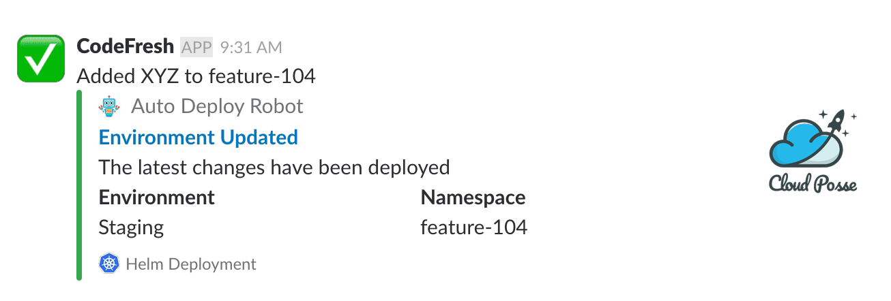

# slack-notifier [](https://travis-ci.org/cloudposse/slack-notifier)


Command line utility to send messages with [attachments](https://api.slack.com/docs/message-attachments)
to [Slack](https://slack.com) channels via [Incoming Webhooks](https://api.slack.com/incoming-webhooks).





## Usage

__NOTE__: The module accepts parameters as command-line arguments or as ENV variables
(or any combination of command-line arguments and ENV vars).
Command-line arguments take precedence over ENV vars.


__NOTE__: The module supports up to 5 Fields in an [attachment](https://api.slack.com/docs/message-attachments)
###


| Command-line argument |  ENV var            |  Description                                                                                                                         |
|:----------------------|:--------------------|:-------------------------------------------------------------------------------------------------------------------------------------|
| webhook_url           | SLACK_WEBHOOK_URL   | Slack [Webhook URL](https://get.slack.help/hc/en-us/articles/115005265063-Incoming-WebHooks-for-Slack)                               |
| user_name             | SLACK_USER_NAME     | Slack user name (the username from which the messages will be sent)                                                                  |
| icon_emoji            | SLACK_ICON_EMOJI    | Slack icon [emoji](https://www.webpagefx.com/tools/emoji-cheat-sheet) for the user's avatar                                          |
| fallback              | SLACK_FALLBACK      | A plain-text summary of the attachment. This text will be used in clients that don't show formatted text                             |
| color                 | SLACK_COLOR         | An optional value that can either be one of `good`, `warning`, `danger`, or a color code (_e.g._ `#439FE0`)                          |
| pretext               | SLACK_PRETEXT       | Optional text that appears above the message attachment block                                                                        |
| author_name           | SLACK_AUTHOR_NAME   | Small text to display the attachment author's name                                                                                   |
| author_link           | SLACK_AUTHOR_LINK   | URL that will hyperlink the author's name. Will only work if `author_name` is present                                                |
| author_icon           | SLACK_AUTHOR_ICON   | URL of a small 16x16px image to the left of the author's name. Will only work if `author_name` is present                            |
| title                 | SLACK_TITLE         | The `title` is displayed as larger, bold text near the top of a message attachment                                                   |
| title_link            | SLACK_TITLE_LINK    | URL for the `title` text to be hyperlinked                                                                                           |
| text                  | SLACK_TEXT          | Main text in a message attachment                                                                                                    |
| thumb_url             | SLACK_THUMB_URL     | URL to an image file that will be displayed as a thumbnail on the right side of a message attachment                                 |
| footer                | SLACK_FOOTER        | Brief text to help contextualize and identify an attachment                                                                          |
| footer_icon           | SLACK_FOOTER_ICON   | URL of a small icon beside the `footer` text                                                                                         |
| image_url             | SLACK_IMAGE_URL     | URL to an image file that will be displayed inside a message attachment                                                              |
| field1_title          | SLACK_FIELD1_TITLE  | Field1 title                                                                                                                         |
| field1_value          | SLACK_FIELD1_VALUE  | Field1 value                                                                                                                         |
| field1_short          | SLACK_FIELD1_SHORT  | An optional boolean indicating whether the `value` is short enough to be displayed side-by-side with other values (default `false`)  |
| field2_title          | SLACK_FIELD2_TITLE  | Field2 title                                                                                                                         |
| field2_value          | SLACK_FIELD2_VALUE  | Field2 value                                                                                                                         |
| field2_short          | SLACK_FIELD2_SHORT  | An optional boolean indicating whether the `value` is short enough to be displayed side-by-side with other values (default `false`)  |
| field3_title          | SLACK_FIELD3_TITLE  | Field3 title                                                                                                                         |
| field3_value          | SLACK_FIELD3_VALUE  | Field3 value                                                                                                                         |
| field3_short          | SLACK_FIELD3_SHORT  | An optional boolean indicating whether the `value` is short enough to be displayed side-by-side with other values (default `false`)  |
| field4_title          | SLACK_FIELD4_TITLE  | Field4 title                                                                                                                         |
| field4_value          | SLACK_FIELD4_VALUE  | Field4 value                                                                                                                         |
| field4_short          | SLACK_FIELD4_SHORT  | An optional boolean indicating whether the `value` is short enough to be displayed side-by-side with other values (default `false`)  |
| field5_title          | SLACK_FIELD5_TITLE  | Field5 title                                                                                                                         |
| field5_value          | SLACK_FIELD5_VALUE  | Field5 value                                                                                                                         |
| field5_short          | SLACK_FIELD5_SHORT  | An optional boolean indicating whether the `value` is short enough to be displayed side-by-side with other values (default `false`)  |


### build the Go program locally

```sh
go get

CGO_ENABLED=0 go build -v -o "./dist/bin/slack-notifier" *.go
```


### run locally with ENV vars

```sh
export SLACK_WEBHOOK_URL="https://hooks.slack.com/services/XXXXXXXX/XXXXXXXX/XXXXXXXXXXXXXXXXXXXXXX"
export SLACK_USER_NAME="CodeFresh"
export SLACK_ICON_EMOJI=":white_check_mark:"
export SLACK_FALLBACK="Deployed to Staging environment"
export SLACK_COLOR="good"
export SLACK_PRETEXT="Added XYZ to feature-104"
export SLACK_AUTHOR_NAME="Auto Deploy Robot"
export SLACK_AUTHOR_LINK="https://cloudposse.com/wp-content/uploads/sites/29/2018/02/small-cute-robot-square.png"
export SLACK_AUTHOR_ICON="https://cloudposse.com/wp-content/uploads/sites/29/2018/02/small-cute-robot-square.png"
export SLACK_TITLE="Environment Updated"
export SLACK_TITLE_LINK="http://demo1.cloudposse.com"
export SLACK_TEXT="The latest changes have been deployed"
export SLACK_THUMB_URL="https://cloudposse.com/wp-content/uploads/sites/29/2018/02/SquareLogo2.png"
export SLACK_FOOTER="Helm Deployment"
export SLACK_FOOTER_ICON="https://cloudposse.com/wp-content/uploads/sites/29/2018/02/kubernetes.png"
export SLACK_FIELD1_TITLE="Environment"
export SLACK_FIELD1_VALUE="Staging"
export SLACK_FIELD1_SHORT="true"
export SLACK_FIELD2_TITLE="Namespace"
export SLACK_FIELD2_VALUE="feature-104"
export SLACK_FIELD2_SHORT="true"

./dist/bin/slack-notifier
```


### run locally with command-line arguments

```sh
./dist/bin/slack-notifier \
    -webhook_url "https://hooks.slack.com/services/XXXXXXXX/XXXXXXXX/XXXXXXXXXXXXXXXXXXXXXX" \
    -user_name "CodeFresh" \
    -icon_emoji ":white_check_mark:" \
    -fallback "Deployed to Staging environment" \
    -color "good" \
    -pretext "Added XYZ to feature-104" \
    -author_name "Auto Deploy Robot" \
    -author_link "https://cloudposse.com/wp-content/uploads/sites/29/2018/02/small-cute-robot-square.png" \
    -author_icon "https://cloudposse.com/wp-content/uploads/sites/29/2018/02/small-cute-robot-square.png" \
    -title "Environment Updated" \
    -title_link "http://demo1.cloudposse.com" \
    -text "The latest changes have been deployed" \
    -thumb_url "https://cloudposse.com/wp-content/uploads/sites/29/2018/02/SquareLogo2.png" \
    -footer "Helm Deployment" \
    -footer_icon "https://cloudposse.com/wp-content/uploads/sites/29/2018/02/kubernetes.png" \
    -field1_title "Environment" \
    -field1_value "Staging" \
    -field1_short true \
    -field2_title "Namespace" \
    -field2_value "feature-104" \
    -field2_short true
```


### build the Docker image
__NOTE__: it will download all `Go` dependencies and then build the program inside the container (see [`Dockerfile`](Dockerfile))


```sh
docker build --tag slack-notifier  --no-cache=true .
```


### run in a Docker container with ENV vars

```sh
docker run -i --rm \
    -e SLACK_WEBHOOK_URL="https://hooks.slack.com/services/XXXXXXXX/XXXXXXXX/XXXXXXXXXXXXXXXXXXXXXX" \
    -e SLACK_USER_NAME="CodeFresh" \
    -e SLACK_ICON_EMOJI=":white_check_mark:" \
    -e SLACK_FALLBACK="Deployed to Staging environment" \
    -e SLACK_COLOR="good" \
    -e SLACK_PRETEXT="Added XYZ to feature-104" \
    -e SLACK_AUTHOR_NAME="Auto Deploy Robot" \
    -e SLACK_AUTHOR_LINK="https://cloudposse.com/wp-content/uploads/sites/29/2018/02/small-cute-robot-square.png" \
    -e SLACK_AUTHOR_ICON="https://cloudposse.com/wp-content/uploads/sites/29/2018/02/small-cute-robot-square.png" \
    -e SLACK_TITLE="Environment Updated" \
    -e SLACK_TITLE_LINK="http://demo1.cloudposse.com" \
    -e SLACK_TEXT="The latest changes have been deployed" \
    -e SLACK_THUMB_URL="https://cloudposse.com/wp-content/uploads/sites/29/2018/02/SquareLogo2.png" \
    -e SLACK_FOOTER="Helm Deployment" \
    -e SLACK_FOOTER_ICON="https://cloudposse.com/wp-content/uploads/sites/29/2018/02/kubernetes.png" \
    -e SLACK_FIELD1_TITLE="Environment" \
    -e SLACK_FIELD1_VALUE="Staging" \
    -e SLACK_FIELD1_SHORT="true" \
    -e SLACK_FIELD2_TITLE="Namespace" \
    -e SLACK_FIELD2_VALUE="feature-104" \
    -e SLACK_FIELD2_SHORT="true" \
    slack-notifier
```


## References
* https://get.slack.help/hc/en-us/articles/115005265063-Incoming-WebHooks-for-Slack
* https://api.slack.com/incoming-webhooks
* https://api.slack.com/docs/message-attachments
* https://api.slack.com/docs/message-formatting
* https://www.webpagefx.com/tools/emoji-cheat-sheet


## Help

**Got a question?**

File a GitHub [issue](https://github.com/cloudposse/slack-notifier/issues), send us an [email](mailto:hello@cloudposse.com) or reach out to us on [Gitter](https://gitter.im/cloudposse/).


## Contributing

### Bug Reports & Feature Requests

Please use the [issue tracker](https://github.com/cloudposse/slack-notifier/issues) to report any bugs or file feature requests.

### Developing

If you are interested in being a contributor and want to get involved in developing `slack-notifier`, we would love to hear from you! Shoot us an [email](mailto:hello@cloudposse.com).

In general, PRs are welcome. We follow the typical "fork-and-pull" Git workflow.

 1. **Fork** the repo on GitHub
 2. **Clone** the project to your own machine
 3. **Commit** changes to your own branch
 4. **Push** your work back up to your fork
 5. Submit a **Pull request** so that we can review your changes

**NOTE:** Be sure to merge the latest from "upstream" before making a pull request!


## License

[APACHE 2.0](LICENSE) © 2018 [Cloud Posse, LLC](https://cloudposse.com)

See [LICENSE](LICENSE) for full details.

    Licensed to the Apache Software Foundation (ASF) under one
    or more contributor license agreements.  See the NOTICE file
    distributed with this work for additional information
    regarding copyright ownership.  The ASF licenses this file
    to you under the Apache License, Version 2.0 (the
    "License"); you may not use this file except in compliance
    with the License.  You may obtain a copy of the License at

      http://www.apache.org/licenses/LICENSE-2.0

    Unless required by applicable law or agreed to in writing,
    software distributed under the License is distributed on an
    "AS IS" BASIS, WITHOUT WARRANTIES OR CONDITIONS OF ANY
    KIND, either express or implied.  See the License for the
    specific language governing permissions and limitations
    under the License.


## About

`slack-notifier` is maintained and funded by [Cloud Posse, LLC][website].


Like it? Please let us know at <hello@cloudposse.com>

We love [Open Source Software](https://github.com/cloudposse/)!

See [our other projects][community]
or [hire us][hire] to help build your next cloud platform.

  [website]: https://cloudposse.com/
  [community]: https://github.com/cloudposse/
  [hire]: https://cloudposse.com/contact/


### Contributors

| [![Erik Osterman][erik_img]][erik_web]<br/>[Erik Osterman][erik_web] | [![Andriy Knysh][andriy_img]][andriy_web]<br/>[Andriy Knysh][andriy_web] |
|-------------------------------------------------------|------------------------------------------------------------------|

  [erik_img]: http://s.gravatar.com/avatar/88c480d4f73b813904e00a5695a454cb?s=144
  [erik_web]: https://github.com/osterman/
  [andriy_img]: https://avatars0.githubusercontent.com/u/7356997?v=4&u=ed9ce1c9151d552d985bdf5546772e14ef7ab617&s=144
  [andriy_web]: https://github.com/aknysh/
